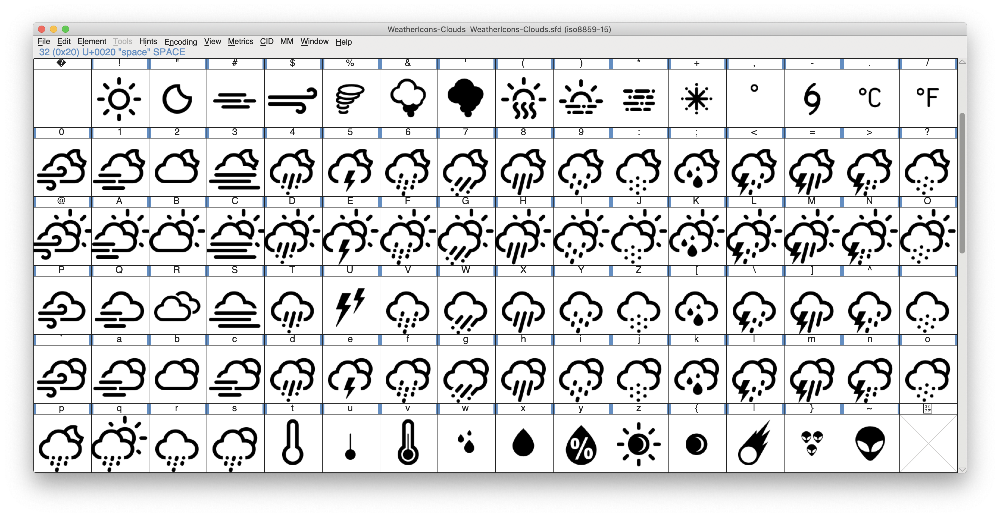
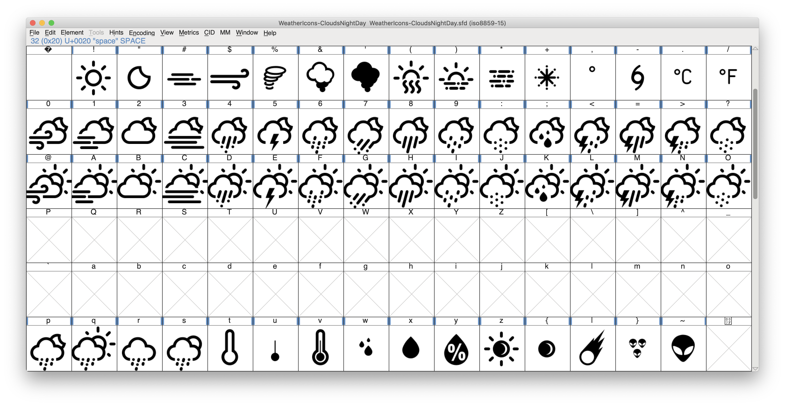
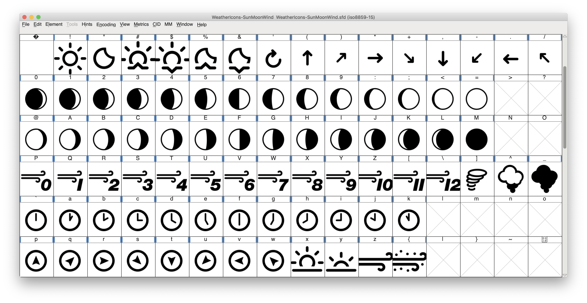

# Fonts

I rearranged and splitted the [WeatherIcons](https://github.com/erikflowers/weather-icons) font by Erik Flowers into 3 different fonts to save resources and use the iso8859 character range.

## WeatherIcons - Clouds (7 Bit)
### Sizes 5pt - 32pt

## WeatherIcons - CloudsNightDay (7 Bit)
### Sizes 5pt - 40pt

## WeatherIcons - SunMoonWind (7 Bit)
### Sizes 5pt - 40pt

